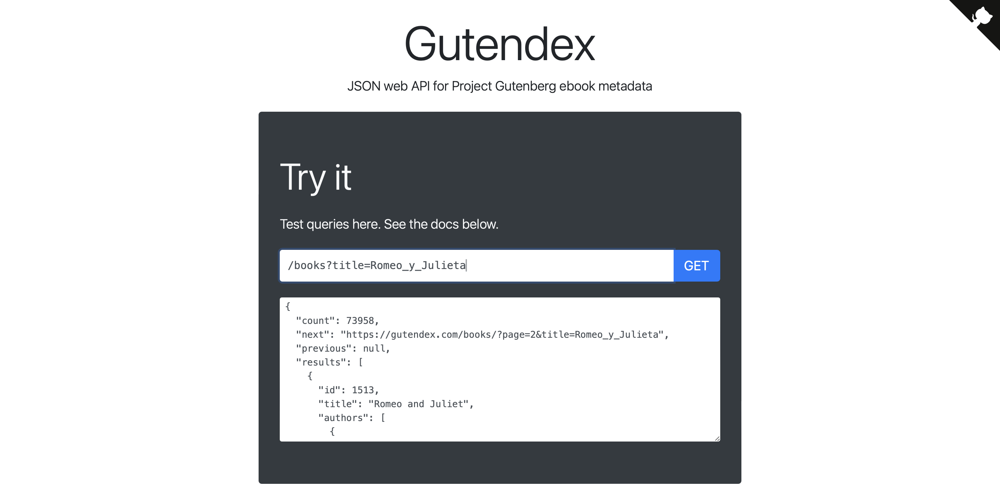

<p align="center">
  
</p>

# Challenge LiterAlura

Respositorio del desafío LiterAlura de la ruta "Desarrollador BackEnd" de Alura Latam y ORACLE ONE.


## Insignias


## Índice

* [Challenge LiterAlura](#Challenge-LiterAlura)

* [Insignias](#insignias)

* [Índice](#índice)

* [Descripción del proyecto](#Descripción-del-proyecto)

* [Estado del proyecto](#Estado-del-proyecto)

* [Características principales](#Características-principales)

* [Acceso al proyecto](#acceso-proyecto)

* [Tecnologías utilizadas](#tecnologías-utilizadas)
  
* [Gutendex API](#Gutendex-API)
  
* [Medalla](#Medalla)

* [Desarrollador](#Desarrollador)


## Descripción del proyecto

Este proyecto se implementa como aplicación Spring Boot diseñada para gestionar un catálogo de libros, interactuando con una base de datos PostgreSQL. La aplicación incluye la funcionalidad de recuperar libros en función de su lenguaje a través de un repositorio JPA personalizado, todo en función de información obtenida con la API Gutendex.

## Componentes principales

* Entidades de JPA
* Repositorios
* Servicios
* Configuración de JPA
* Aplicación Principal

## Modalidad de trabajo

La modadlidad de trabajo se dió bajo el sistema ágil de desarrollo, por medio de la herramienta Trello, considerando las  siguientes etapas:

* "Listos para iniciar"
* "En Desarrollo"
* "Pausado"
* "Concluido"

La interfaz de usuario se puede apreciar a continuación:

[](https://trello.com/b/WDyMPDMb/literalura-challenge-java)


## Estado del proyecto

EL proyecto está desarrollado para cumplir con lo solicitado por el Challenge, pero aún tiene cosas por mejorar. Por ejemplo, se podría optimizar la configuración de JPA, simplificar la gestión de la unidad de persistencia y añadir pruebas unitarias para garantizar la estabilidad y funcionalidad del programa.

### Características principales

* Integración con Gutendex API.
* Almacenamiento en PostgreSQL.
* Uso de Spring Boot.
* Configuración JPA.
* Repositorio de Libros.
* Manejo de Excepciones.
* Inyección de Dependencias.

## Acceso al proyecto

Puedes clonar este repositorio usando el siguiente comando:

```sh
git clone https://github.com/Nicole-lq/Challenge_literatura_NLQ.git
```

## Tecnologías utilizadas

* Java 17
* Maven
* HttpClient
* JSON
* IntelliJ IDEA

## Gutendex API

La API Gutendex es una interfaz que proporciona acceso a una colección de libros electrónicos del Proyecto Gutenberg, los cuales son de dominio público. Esta API permite buscar y recuperar información detallada sobre los libros mediante diversos criterios como título, autor, idioma y tema. Además, ofrece funcionalidades de filtrado, ordenación y paginación de los resultados, lo que facilita la gestión de grandes conjuntos de datos. La API devuelve los resultados en formato JSON, facilitando la integración de éstos a diferentes plataformas de trabajo, permitiendo incorporar recursos literarios de dominio público a proyectos personales de manera rápida y sencilla.

[](https://gutendex.com)


## Medalla
<p align="center">

</p>


## Desarrollador

|[<br><sub> Nicole Lastra Quiroz </sub>](https://github.com/Nicole-lq)|
|---|
